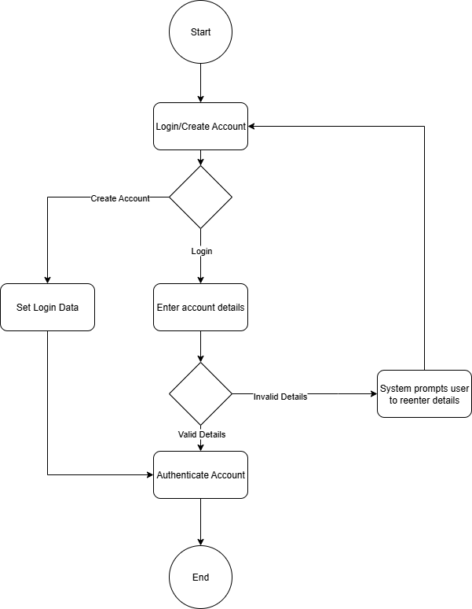

# CPS490-Auction
Auction app for UDayton Capstone 490 - Wyatt Bier, Erich Jaster, Thomas McGinley\
Trello Board - [Link](https://trello.com/invite/b/68cabc69a8381973073a0192/ATTI525aeaf989044b218676779a4d1f59b29800A9B2/cps-490-auction)

1. Introduction
   * Purpose
      * Summarize the project, including a short description of the purpose of the system being built.
   * Scope
      * A clear description of what portions of this project that this document is intended to cover.
   * Definitions & Acronyms
      * Define any terms used in the document that may not be obvious to the reader.
   * References
      * Any documents referred to in the creation of this systems analysis.
   * Overview
      * A short description of the rest of the document, detailing what each section covers and where information may be found.
2. Overall Description
   * Product Perspective
      * An overview of the environment that this system must operate within, including other software and hardware systems that will interface with this system.
   * Product Functions
      * An overview of the features to be provided by the software.
   * User Characteristics
      * Description of the types of users that will interact with this software and
          assumed properties of those users.
   * Constraints
      * Any constraints that have been placed on the project (that are not, in
          themselves, requirements)
   * Assumptions
      * Any assumptions that are being made in specifying these requirements.
3. Systems Analysis
   * Context level data flow diagram
   * Context level entity relationship diagram

4. Use Cases

   User Account Authenticate/Login
   
   
   * Scenarios
   * Diagram(s)
