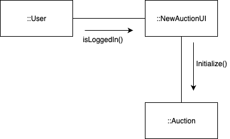
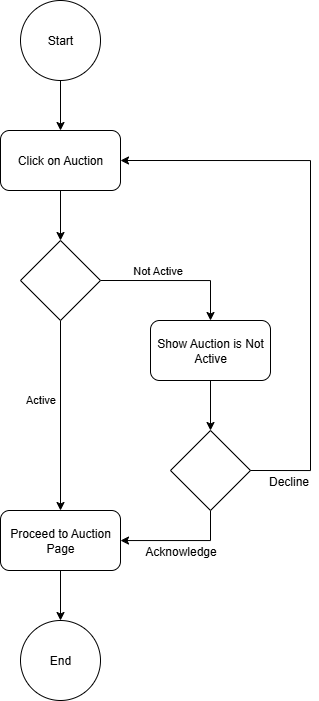
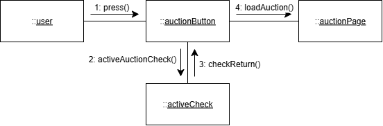
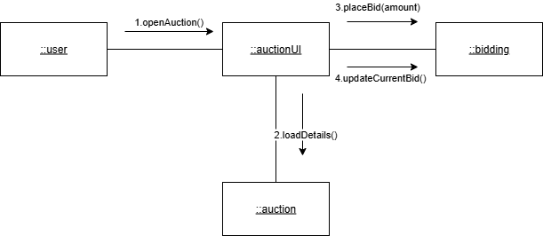
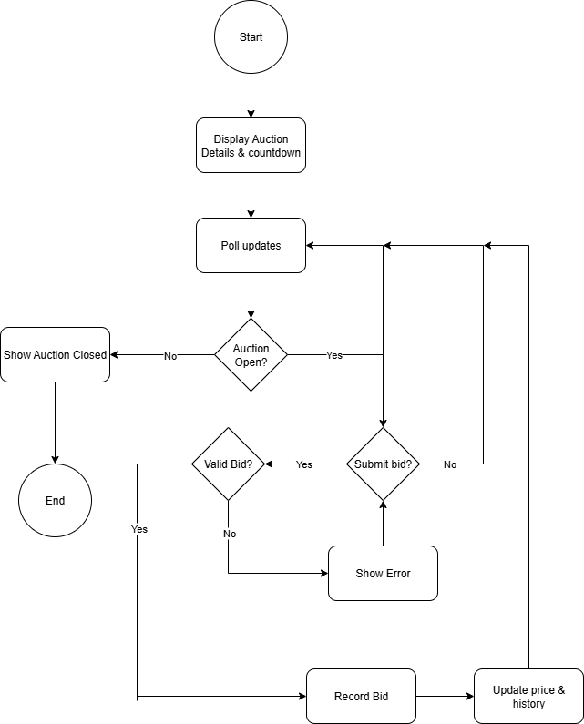

# CPS490-Auction
Auction app for UDayton Capstone 490 - Wyatt Bier, Erich Jaster, Thomas McGinley
Trello Board - [Link](https://trello.com/invite/b/68cabc69a8381973073a0192/ATTI525aeaf989044b218676779a4d1f59b29800A9B2/cps-490-auction)

# 1. Introduction
   * Purpose
      * Summarize the project, including a short description of the purpose of the system being built.
   * Scope
      * A clear description of what portions of this project that this document is intended to cover.
   * Definitions & Acronyms
      * Define any terms used in the document that may not be obvious to the reader.
   * References
      * Any documents referred to in the creation of this systems analysis.
   * Overview
      * A short description of the rest of the document, detailing what each section covers and where information may be found.
# 2. Overall Description
   * Product Perspective
      * An overview of the environment that this system must operate within, including other software and hardware systems that will interface with this system.
   * Product Functions
      * An overview of the features to be provided by the software.
   * User Characteristics
      * Description of the types of users that will interact with this software and
          assumed properties of those users.
   * Constraints
      * Any constraints that have been placed on the project (that are not, in
          themselves, requirements)
   * Assumptions
      * Any assumptions that are being made in specifying these requirements.
# 3. Systems Analysis
   * Context level data flow diagram
   * Context level entity relationship diagram

# 4. Use Cases
## Use case 1: User Account Authenticate/Login
Description: This use case describes the process by which a user adds a new item to the auction page

Actors:
- User (primary actor)

Preconditions:
- The user has an account.
- The system is online and accessible.

Postconditions:
- User has an account.
- User is logged into their account.

Basic flow (main success scenario):
1. The user clicks a button to take them to the login page.
2. The user selects to either login to an existing account or create a new one.
3. The user fills in the form with a username and password.
4. The system verifies that the username is available or the username and password match the database
5. The user is logged in and returned to the all auctions page

Alternative flows:
- Incomplete form:
   1. Steps 1-5 of basic flow.
   2. The system finds the form to be incomplete.
   3. An error message displays, telling the user which fields are still required.
   4. The required fields that were incomplete are highlighted.
   5. The user can fill in the required fields or return to the main screen.
- Username is taken:
   1. Steps 1-4 of basic flow.
   2. The system finds that the username is not unique
   3. The system displays an error message, telling the user that the username is not unique
   4. The user can enter a new username or return to main screen.
- Username and password do not match the database
   1. Steps 1-4 of basic flow.
   2. The system finds that the username exists in the database and the password does not match
   3. The system displays an error message, telling the user that the password is incorrect
   4. The user can enter a new password or return to the main screen.

Exceptions:
- System Unavailable: If the system is offline or encountering errors during the login attempt, a "System Unavailable" message is displayed.

---
### Activity Diagram:

---
### Communication Diagram:

## Use case 2: Users can add an auction item
Description: This use case describes the process by which a user adds a new item to the auction page

Actors:
- User (primary actor)

Preconditions:
- The user has an account and is logged into the application.
- The system is online and accessible.

Postconditions:
- Auction item created: An auction item is added with a description, title, and end time.

Basic flow (main success scenario):
1. The user clicks a button to take them to the auction item creation page.
2. The system checks that the user is logged in.
3. The system displays a form for the user to fill in:
   - Title, description, and end date are required fields.
   - Starting bid is an optional field.
4. The system prompts the user to upload an image of the auction item.
5. The user selects the publish button.
6. The system validates that the form is completed with the required fields.
7. The user is taken to the newly created auction page.

Alternative flows:
- Incomplete form:
   1. Steps 1-5 of basic flow.
   2. The system finds the form to be incomplete.
   3. An error message displays, telling the user which fields are still required.
   4. The required fields that were incomplete are highlighted.
   5. The user can fill in the required fields or return to the main screen.
- End time in the past:
   1. Steps 1-5 of basic flow.
   2. The system finds the end time to be a time in the past.
   3. An error message displays, telling the user that the end time is in the past.
   4. The end time field is highlighted.
   5. The user can retry the form or return to the main screen.
- User not logged in:
   1. Steps 1-2 of basic flow.
   2. The system finds that the user is not logged in.
   3. The system redirects the user to login page.

Exceptions:
- System Unavailable: If the system is offline or encountering errors during the login attempt, a "System Unavailable" message is displayed.
---
### Activity Diagram:

---
### Communication Diagram:

## Use case 4: User can click on active auctions
Description: This use case describes the process by which a user clicks on an auction to access that specific auction’s information.

Actors:
- User (Primary Actor)

Preconditions:
- The system is online and accessible.

Postconditions:
- The user can see all active auctions.

Basic Flow (Main Success Scenario):
1. The user sees all active auctions.
2. The user chooses an auction to click on.
3. The system checks whether the auction is active.
4. The system returns that the auction is active.
5. The system loads the auction page.

Alternative Flows:
- Auction Not Active:
    1. Steps 1-3 of Basic Flow.
    2. The system that returns the auction is not active.
    3. The system displays an "Auction Ended" message with an "acknowledge" and "return to auctions" buttons.
    4. The user presses the "return to auctions" button.
    5. The system loads the active auctions page.
- Auction Ended Acknowledgement:
    1. Steps 1-3 of Basic Flow.
    2. Steps 1-3 of Auction Not Active Alternative Flow.
    3. The user presses the "acknowledgement" button.
    4. The system loads the auction page.

Exceptions:
- System Unavailable: If the system is offline or encountering errors during the login attempt, a "System Unavailable" message is displayed.

---
### Activity Diagram:

---
### Communication Diagram:

## Use case 5: User sees auction page and its details
Description: This use case describes the process by which a user clicks onto a specific auction and views its details

Actors:
- User (primary actor)

Preconditions:
- The system is online and accessible.

Postconditions:
- User sees the auction they chose to look at.
- User may create a bid on the auction if they choose to.

Basic flow (main success scenario):
1. The user clicks a button to take them to the auction page they selected.
2. The system displays auction details:
   - Title, description, current highest bid, bidding countdown
3. The system will continue to update the current bid and the countdown as long as the user is still viewing it and the auction is not closed.
4. User submits bid.
5. System checks and confirms that the bid is valid.
6. System records the bid and updates bidding history.

Alternative flows:
- Auction closed:
   1. Steps 1-3 of basic flow.
   2. The system finds the auction to be closed.
   3. The system will close bidding access to that auction and stop updating the acution details.
- User chooses not to bid:
   1. Steps 1-3 of basic flow.
   2. User chooses not to bid.
   3. System continues to update the auction details; leaving the option to bid open to the user as long as the auction is open.
- User's bid not valid:
   1. Steps 1-4 of basic flow.
   2. The system finds that the user's bid is not valid.
   3. The system shows error/warning about the bid not being valid.
   4. The system prompts user to retry bid again if they wish to.

Exceptions:
- System Unavailable: If the system is offline or encountering errors during the login attempt, a "System Unavailable" message is displayed.
---
### Communciation Diagram:

---
### Activity Diagram:
