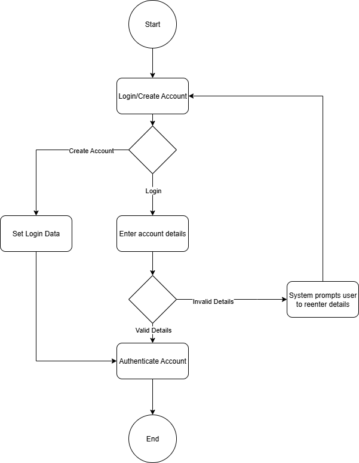
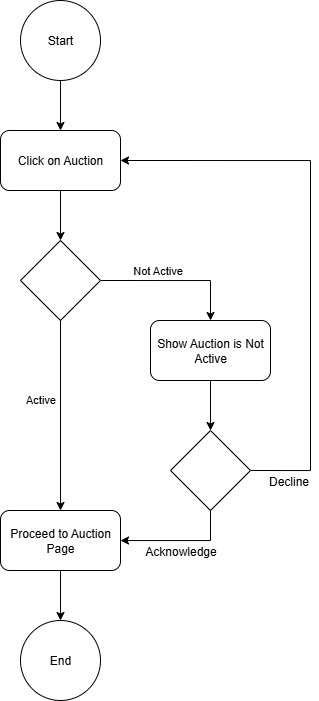
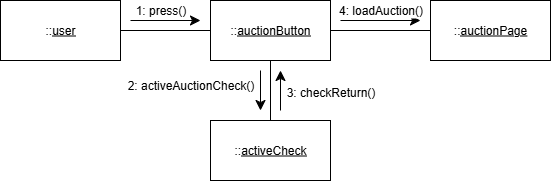
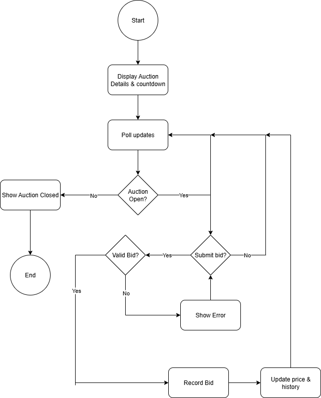

# CPS490-Auction
Auction app for University of Dayton Capstone 490 - Wyatt Bier, Erich Jaster, Thomas McGinley
Trello Board - [Link](https://trello.com/invite/b/68cabc69a8381973073a0192/ATTI525aeaf989044b218676779a4d1f59b29800A9B2/cps-490-auction)

# 1. Introduction
   * Purpose
      * This document defines the initial ideas for a basic auction web application. The system's purpose is to let authenticated users list items for auction, browse all active auctions, open an auction to see its details with a real-time countdown, and bid using tokens with a live bid history.
   * Scope
      * User-level functionality captured as use cases and use case descriptions for each required feature.
      * One communication diagram per use case.
      * Activity diagrams capturing behavior across or within use cases.
   * Definitions & Acronyms
      * Active Auction - An auction that has started and has not yet reached its end time.
      * Token - The in-app bidding currency used to place bids.
      * Bid History – Chronological record of accepted bids for a given auction, shown to users in near real time.
      * Real-time – Server-to-client updates during an auction.
      * UI – User Interface (the web page/screens users interact with).
      * Use Case – A description of system behavior from a user’s perspective to achieve a goal.
      * Communication Diagram – UML interaction diagrams showing objects and message order.
      * Activity Diagram – UML diagram that models control flow and decision logic.
      
# 2. Overall Description
   * Product Perspective
      * The system is using the MERN stack architecture for creating and running the application:
         - MongoDB is used to handle database functions.
         - Express.js is used to build the web application and associated APIs.
         - React is used to develop the user interface.
         - Node.js is the runtime environment that the application will run in.
   * Product Functions
      * Users can create an account allowing them to:
         - Place items up for auction.
         - Make bids on existing auctions.
      * Users can view all active auctions and choose filters to find relevant auctions.
      * Users can click on an auction to see details and place a bid.
   * User Characteristics
      * Users may be individuals seeking to place bids on ongoing auctions.
      * Users may be seeking to place items up for auction.
      * Users may not be looking for a particular auction, but may find one that they are interested in after accessing the application.

# 3. Use Cases
## Use case 1: User Account Authenticate/Login
Description: This use case describes the process by which a user authenticates (logs in or creates an account).

Actors:
- User (primary actor)

Preconditions:
- The user has an account.
- The system is online and accessible.

Postconditions:
- User has an account.
- User is logged into their account.

Basic flow (main success scenario):
1. The user clicks a button to take them to the login page.
2. The user selects to either login to an existing account or create a new one.
3. The user fills in the form with a username and password.
4. The system verifies that the username is available or the username and password match the database.
5. The user is logged in and returned to the active auctions page.

Alternative flows:
- Incomplete form:
   1. Steps 1-5 of basic flow.
   2. The system finds the form to be incomplete.
   3. An error message displays, telling the user which fields are still required.
   4. The required fields that were incomplete are highlighted.
   5. The user can fill in the required fields or return to the main screen.
- Username is taken:
   1. Steps 1-4 of basic flow.
   2. The system finds that the username is not unique.
   3. The system displays an error message, telling the user that the username is not unique.
   4. The user can enter a new username or return to the main screen.
- Username and password do not match the database:
   1. Steps 1-4 of basic flow.
   2. The system finds that the username exists in the database and the password does not match.
   3. The system displays an error message, telling the user that the password is incorrect.
   4. The user can enter a new password or return to the main screen.

Exceptions:
- System Unavailable: If the system is offline or encountering errors during the login attempt, a "System Unavailable" message is displayed.

---
### Activity Diagram:

---
### Communication Diagram:

## Use case 2: Users can add an auction item
Description: This use case describes the process by which a user adds a new item to the auction page.

Actors:
- User (primary actor)

Preconditions:
- The user has an account and is logged into the application.
- The system is online and accessible.

Postconditions:
- Auction item created: An auction item is added with a description, title, and end time.

Basic flow (main success scenario):
1. The user clicks a button to take them to the auction item creation page.
2. The system checks that the user is logged in.
3. The system displays a form for the user to fill in:
   - Title, description, and end date are required fields.
   - Starting bid is an optional field.
4. The system prompts the user to upload an image of the auction item.
5. The user selects the publish button.
6. The system validates that the form is completed with the required fields.
7. The user is taken to the newly created auction page.

Alternative flows:
- Incomplete form:
   1. Steps 1-5 of basic flow.
   2. The system finds the form to be incomplete.
   3. An error message displays, telling the user which fields are still required.
   4. The required fields that were incomplete are highlighted.
   5. The user can fill in the required fields or return to the main screen.
- End time in the past:
   1. Steps 1-5 of basic flow.
   2. The system finds the end time to be a time in the past.
   3. An error message displays, telling the user that the end time is in the past.
   4. The end time field is highlighted.
   5. The user can retry the form or return to the main screen.
- User not logged in:
   1. Steps 1-2 of basic flow.
   2. The system finds that the user is not logged in.
   3. The system redirects the user to the login page.

Exceptions:
- System Unavailable: If the system is offline or encountering errors during the login attempt, a "System Unavailable" message is displayed.
---
### Activity Diagram:

---
### Communication Diagram:

## Use case 3: User can see all active auctions
Description: This use case describes the process by which a user is able to view all active auctions.

Actors:
- User (Primary Actor)

Preconditions:
- The system is online and accessible.

Postconditions:
- The user can see all active auctions on a single page.

Basic Flow (Main Success Scenario):
1. The user accesses the site.
2. The system displays all active auctions on the main page.
3. The user clicks on an auction to view more details or place a bid.

Alternative Flows:
- Auctions filtering:
   1. Steps 1-2 of basic flow.
   2. The user chooses to filter auctions.
   3. The user is shown a reduced list of active auctions.

Exceptions:
- System Unavailable: If the system is offline, a "System Unavailable" message is displayed.
---
### Activity Diagram:

---
### Communication Diagram:

## Use case 4: User can click on active auctions
Description: This use case describes the process by which a user clicks on an auction to access that specific auction’s information.

Actors:
- User (Primary Actor)

Preconditions:
- The system is online and accessible.

Postconditions:
- The user sees the selected auction’s page.

Basic Flow (Main Success Scenario):
1. The user sees all active auctions.
2. The user chooses an auction to click on.
3. The system checks whether the auction is active.
4. The system returns that the auction is active.
5. The system loads the auction page.

Alternative Flows:
- Auction Not Active:
    1. Steps 1-3 of Basic Flow.
    2. The system returns the auction is not active.
    3. The system displays an "Auction Ended" message with an "acknowledge" and "return to auctions" buttons.
    4. The user presses the "return to auctions" button.
    5. The system loads the active auctions page.
- Auction Ended Acknowledgement:
    1. Steps 1-3 of Basic Flow.
    2. Steps 1-3 of Auction Not Active Alternative Flow.
    3. The user presses the "acknowledgement" button.
    4. The system loads the auction page.

Exceptions:
- System Unavailable: If the system is offline, a "System Unavailable" message is displayed.
---
### Activity Diagram:

---
### Communication Diagram:

## Use case 5: User sees auction page and its details
Description: This use case describes the process by which a user clicks on a specific auction and views its details.

Actors:
- User (primary actor)

Preconditions:
- The system is online and accessible.

Postconditions:
- User sees the auction they chose to look at.
- User may create a bid on the auction if they choose to.

Basic flow (main success scenario):
1. The user clicks a button to take them to the auction page they selected.
2. The system displays auction details:
   - Title, description, current highest bid, bidding countdown.
3. The system continues to update the current bid and the countdown as long as the user is still viewing it and the auction is not closed.
4. The user submits bid.
5. The system checks and confirms that the bid is valid.
6. The system records the bid and updates bidding history.

Alternative flows:
- Auction closed:
   1. Steps 1-3 of basic flow.
   2. The system finds the auction to be closed.
   3. The system will close bidding access to that auction and stop updating the auction details.
- User chooses not to bid:
   1. Steps 1-3 of basic flow.
   2. User chooses not to bid.
   3. System continues to update the auction details; leaving the option to bid open to the user as long as the auction is open.
- User's bid not valid:
   1. Steps 1-4 of basic flow.
   2. The system finds that the user's bid is not valid.
   3. The system shows error/warning about the bid not being valid.
   4. The system prompts user to retry bid again if they wish to.

Exceptions:
- System Unavailable: If the system is offline, a "System Unavailable" message is displayed.
---
### Communciation Diagram:

---
### Activity Diagram:
